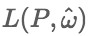
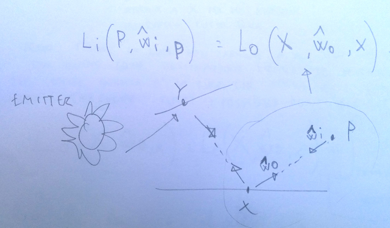
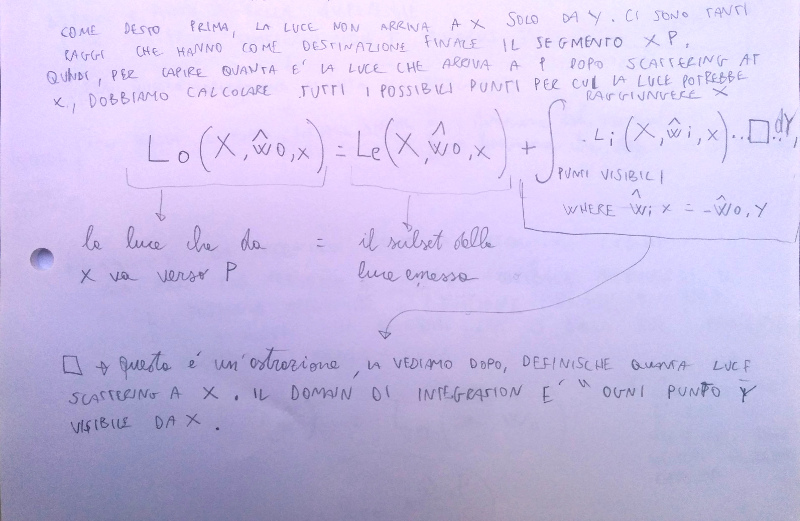
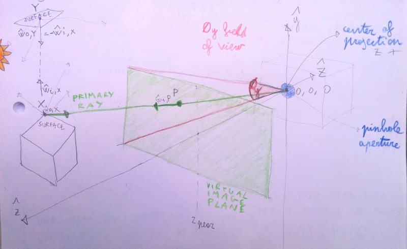
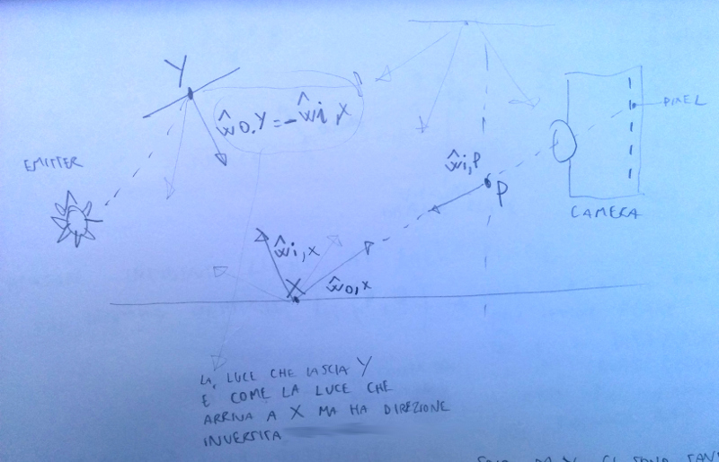
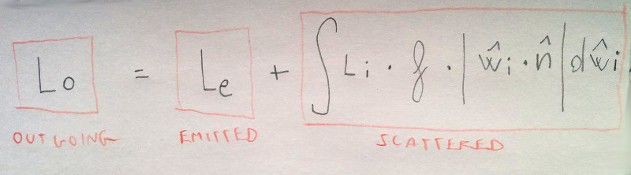

# Ray Caster

-this notes are just for personal use-


This project is an exercise part of the programming projects course [graphix codex](http://graphicscodex.com/) by Morgan McGuire. All the quotes that you see in this file comes from this online book.


## A model of light
It defines a way to summarize Light. Every representaion of the light field is always a simplification.

### Image as digital measurement

> "A real digital camera is a measurement device. It measures the amount of light striking each pixel of its sensor and records it as a number"

Ray caster is simply measuring the light striking each pixel.


### Rays of Lights
Light propagates along a ray through a medium, you can only see the light rays that enter your eyes. If you consider your eye as a surface, you are seeing just the end point of this rays and they look like points. The collection of this point gives you an image.

A mathematical ray has a point and a direction.
As datastructure, I have presented it like this:

```cpp
#pragma once
#include "ofMain.h"

class Ray {
public:
    Ray(glm::vec3 origin, glm::vec3 direction);
    /* Starting point $P$ */
    glm::vec3   origin;
    /* Unit vector $\w$ */
    glm::vec3  direction;
};
```

A *line segment* has a starting point and an ending point.

The light travel along a *line segment*. When I'm doing the calculation, I do not know where this line segment will end, I just know the origin and the direction stored in the ray.

A *light transport path* is a collection of light segments.
The transport paths that I consider in my renderer originate at a surface that generate photons. In the implementaion, this source is an `ofLight` instance

### The Light Field



This formula denotes the Light ad P propagating in direction w

In an "empty space", where there aren't mediums that are absorbing light, the light must be conserved along a ray. This means that in an empty space and with nothing between X and Y, like in the sketch, the light that leaves X in direction P will actually reach P, without any dispersions. This means that what matters, in rendering, are only the events where light change direction.

This skecth focuses only on the segment X -> P.


It is just saying that:
The incoming light `Li` that reaches `P` in direction `wi`, IS EQUAL to the the outcoming light `Lo`, that from the point `X`  goes to `P` in direction `wo`.

This amount of light is just a fraction of the light that has left `Y` in direction `X`. The rays that reaches `X` are a lot, it is not just this segment,

That's why the previous equation needs to be improved. See this picture for the second part of the equation


*P.S.* a common error is mixing up the direction of the ray. Have a look at the last note in picture number 2.


## A camera model



The implementation of the camera model is in the file `PinholeCamera`. This class has a `position`, a `z_near` distance (look at the picture to see what it is) and an angle that defines the vertical field of view. The main method that this class has is 'getPrimaryRay'. Given x and y of the image, it find the primary ray.

### A Modern Computational Renderer

#### Load a scene
I have tested the renderer first with a cube, then with a teapot and finally with the Cornell's Box.
I have load an obj file using the ofxAssimpModelLoader addon. This model contains meshes, I have iterated through them and I have converted them to `of3DPrimitive`. See this answer [thread in the OF forum](https://forum.openframeworks.cc/t/get-global-vertices-position-of-an-instance-of-ofxassimpmodelloader/27433/5?u=edapx). This was the easiest way to have the mesh and the global transformation matrix, I need this matrix because the calculation in the ray caster are in word perspective.
It is good practice to separate the data from the ray caster implementation.

#### Measure incident light per pixel

This is the core, getting this picture means getting 90% of the renderer.



In order, you need to:

- Find the point X that scatters light in direction P. Here you use the ray casting algorithm. Because this point it is not just a point, but it contains other information, light shading normal, geometric noraml, color etc.. we need a better datastructure than a glm::vec3. G3D is using a `Surfel`, in OF there is no such thing, I therefore created the class `Surfel`.
- Once you have the Surfel, you apply the equation that you see in the first picture of the paragraph "The Light Field". Pay attention, you have to *invert the direction of the light!*, `wo` it is simply equal to `-wi`. This part is in the `RayTracer.cpp` file, method `RayCaster::L_i(const Ray& ray)`
- Estimate emitted radiance. This is the radiance that the surface is emitting. In my current implementation it is null, as 90% of the material are usually not emissive
- Find out scattered radiance. A simple approximation of scattered radiance is to calculate just the light that hot `X` directly from point emitters (in my case an instance of `ofLight`). This is called *direct illumination*

### Dynamic range
The problem is that the color range that our monitor is giving us does not corrispond to reality. A black image on monitor in a room it is still glowing, and a white image on a monitor in a park in a sunny day is fairly dim, you can not compete with the power of the sun. `Tone Mapping` is just a way to put the colors of an image in a way that look reasonable. Desaturation, Bloom and Gamma encoding are just tree way that you can use to adjust your image in order to have a range of color that looks more realistic.
I did not implement any of this corrections in my renderer.


## Ray Caster loop

The core of the ray caster is the method to find an intersetion between a ray and a mesh. When the mesh is a sphere, you can use an analytical solution to find it, as the equation that describe a sphere it is easier compared to the equation that you have to use when looking for the intersection with a triangle. But as mesh are made out of triangle, I implemented just a method that loops through all the meshes and find the closest intersection with a trangle. As GLM already provide one method, I have used that one, `glm::intersectRayTriangle`. You can see the implementation in the method `findFirstIntersectionWithThePrimitives` in the `RayCaster` class. In that method implementation there are also comments that explain how to solve some problems, like ordering the intersection when there is more than one intersection between a ray and a triangle.

in pseudo code, a ray casting loop does this:

```
for(each x and y in the virtual image plane){
    ray = findThePrimaryRay(x,y,camera);
    if (intersect(ray, mesh)) {
        // shade the intersection point. What is the emitted/reflected light towards the camera?
        Color c = getShadePointColor(ray, mesh, material);
        writeFrameBuffer(x, y, c);
    } else {
        Color c =  backGroundColor;
        writeFrameBuffer(x, y, c);
    }
}
```

### About deferred shading
This pseudocode above refers to what is called a `forward shading`, in contrast to `deferred shading` [def. shading](https://en.wikipedia.org/wiki/Deferred_shading). In my renderer, I have implemented a forward shading.

In a deferred shading, we first save the information about position, normal, color in a buffer, called `G-Buffer`. In a second step we iterate over the G-Buffer and we calculate the shading. The pseudocode will be something like this:

```
clearGeometryBuffer();
fillDepthBuffer(infinity);
for(each x and y in the virtual image plane){
    float primDepth = getDepthOfPrimitiveAtPixel(x,y);
    if (primDepth > readDepthBuffer(x,y)) {
        // pixel of this primitive is obsured, discard it
        continue
    } else {
        getPrimitiveShadingInfo(mat, pos normal);
        writeGeometryBuffer(x,y,mat,pos,normal); 
        writeDepthBuffer(x, y, primDepth);
    }
}


for(each x and y in the virtual image plane){
    ray = findThePrimaryRay(x,y,camera);
    if (readDepthBuffer(x,y) == infinity) {
        // no geometry here
        Color c =  backGroundColor;
        writeFrameBuffer(x, y, c);

    } else {
        readGeometryBuffer(x,y, mesh, material);
        Color c = getShadePointColor(position, mesh, material);
        writeFrameBuffer(x, y, c);
    }
}
```
Again, deferred rendering it is not implemented, but it is worth to explain why it is popular.
When there are multiple lights, it could be expensive to calculate the final color of a pixel in a single calculation (that is, what the `getShadePointColor` is doing in both of the examples above, and what your loop `for (int i = 0; i<lights.size(); i++) {` in `L_scatteredLight` is doing). Instead, we must. use multiple passes, and *accumulate* the reflected light for each source in the frame buffer. In the forward rendering, these extra passes involve rendering the primitives. In the deferred rendering, extra passes are already in image space (see the pictures in the right colum of the wikipedia page to understand it better), and we can read the geometries from the Geometry Buffer. In this situation, the def shading is much more performant.


#### Texture coordinates
This part is yet not implemented

## Shading
In my implementation i consider only direct illumination. This means that my calculation will always underestimate the light. In the book, the chapter that I have taken as riferiment is the "Direct Illumination one".

Once an intersection is founded, I have to find how much light is that Surfel reflecting and in which direction. In my renderer, the method is `L_0(surfelY, -ray.direction);` in the RayCaster class.
When considering only direct illumination the outgoing light can be seen as emitted radiance + scattered illumination.



The biggest challange here is to find out scattered radiance. The method that does this is called `L_scatteredDirect` in the `RayCaster` class.

My implementation comes from this [article](http://www.informit.com/articles/article.aspx?p=2115288&seqNum=4).
Another more complete c++ renderer can be found [here](https://github.com/seanzw/yart-cpp)

### Describing surfaces properties, the BRDF
The *Bidirectional reflectional distribution function*, aka BRDF, answer to this question:
"When a light of a given color strikes the surface from a given incident direction, how much of that light is reflected in some other particular direction?"

From "3D Matht Primer for graphics and game development"

> Simbolically, the BRDF function is written as a function `f(x, win, wout, gamma)`. The value of this function returns a scalar that describe the relatively likelihood that light incident at the point `x` from direction `win` will be reflected in the outgoing direction `wout`. `gamma` is the value that defines the color, different colors of light are usually reflected differently, hence the dependency on gamma.

The two material property, shiness and color, can precisely be expressed in the framework of a BRDF.
Two examples to understand BRDF better

1. a green ball looks green because it assorbes, for examples, 95% of red and blue light and it reflects just the 5% of that light. The green light is not absorbed, and it is 100% reflected, that's why it looks green
2. Consider the difference between a shiny red plastic and a sheet of red paper (not lucid). The shiny red surface reflects incident light much more strongely in one particular direction, while the red paper scatters light more evenly across differents directions. To summarize, the BRDF function accounts for the difference in shininess of two objects.

More complicated phenomena can be described generalizing the BRDF:

1. The light could point back to the surface, generation translucence and light refraction. This can be bescribed by a BSSDF function, *Bidirectional surface scattering distribution function*.
2. Sometimes light goes into the object and bounce into it before to go out. This happens for example with a glass of milk or with skin. This is called *subsurface scattering*, and requires splitting the single refraction point x in `xin` and `xout`2, which is used by the BSSDF, *Bidirectional surface scattering distribution function*
3. Even volumetric effects, like fog, can be espressed dropping the word *surface* and defining a BSDF, *Bidirectional scattering distribution function*, at any point in space, not just on surfaces.


## Indirect Rays
Initially, when calculating the light at a certain point, it was just using lambert light, ambient light and a value for the biradiance.
But to complete the last part of the integral equation, that in the sketch before was underlined as "scattered", we have to consider indirect rays.
To calculate indirect rays, you take normal of the surface looking at the light, and you create an hemisphere pointing in that direction. Then you create a random number of normalized vectors, that has origin the point on the surface, and as ending point a point on the surface of the hemisphere.
To create this "hemisphere of vector", I have first create a bunch of random vectors:

```cpp
// http://corysimon.github.io/articles/uniformdistn-on-sphere/
glm::vec3 ofxRayTracer::getRandomDir() const{
    float x = ofRandom(-1.0f, 1.0f);
    float y = ofRandom(-1.0f, 1.0f);
    float z = ofRandom(-1.0f, 1.0f);
    return glm::normalize(glm::vec3(x, y, z));
}
```

Then I've dropped out all the vectors that are not in the hemisphere orientated by the normal defined by the light position - the position of the point on the surface.

```cpp
glm::vec3 rdir = getRandomDir();
glm::vec3 wi = glm::normalize(lightPos - surfelX->getPosition());
float acos = glm::dot(offset, rdir);
if(acos > 0){
    // proceed with light calculation
}else{
    // drop it, it is in the negative part of the hemisphere
}
```

## Sampling
To resolve aliasing, it is common practice to shoot more than one ray per pixel, shifted a bit from the center, calculate the color for each ray, and then calculate the average of the color. The wikipedia page has a good explanation about it and about all the problem you can [have](https://en.wikipedia.org/wiki/Supersampling). To add sampling to my implementation, it was enough to change the main loop adding this part

```cpp
for (int sample = 0; sample < tot_samples; sample++){
  glm::vec3 P;
  glm::vec3 w;

  double xx = x + rand()/(double)RAND_MAX;
  double yy = y + rand()/(double)RAND_MAX;

  // Find the ray through (x, y) and the center of projection
  camera.getPrimaryRay(xx + 0.5f, yy + 0.5f, width, height, P, w);
  auto color = L_i(ofxRTRay(P, w), n_rays);
  averageColor.x += color.r;
  averageColor.y += color.g;
  averageColor.z += color.b;
  averageColor.w += color.a;
}

auto finalCol = averageColor * (1/(double)tot_samples);
ofColor finalColor = ofColor(finalCol.r,finalCol.g,finalCol.b,finalCol.a);
renderPixels.setColor(x, y, finalColor);                           
```


