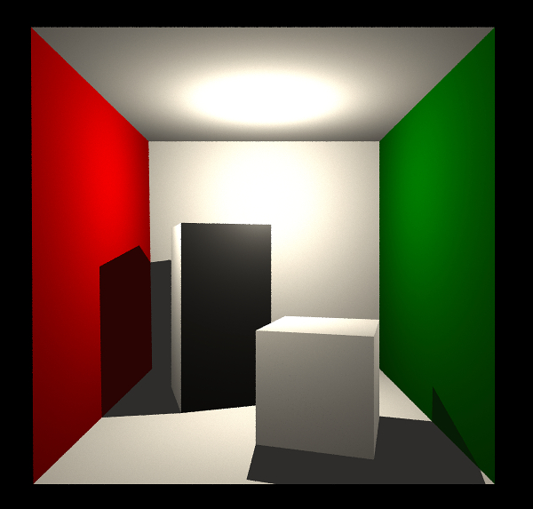

# ofxRayTracer
A Ray Tracer in openFrameworks, work in progress



As I've said WIP ;)

### Requirements.
You need to install tbb. On MacOS, follow this [answer on SO](https://stackoverflow.com/questions/45884514/what-are-xcode-8-environment-variables-to-run-intel-threading-building-blocks)

This ray tracer implementation was written as exercise for this [online course](http://graphicscodex.com/projects/rays/index.html), course prepared by prof. Morgan McGuire


It is still incomplete and it is intended for personal use, WIP. It provides a way to load an `.obj` file through the `ofxAssimpModelLoader` and render it. If you want to try it out, that's how you set up a scene, loading the model and you putting the meshes in a `vector<Primitives>`


```cpp
shared_ptr<ofImage> image;
ofxAssimpModelLoader modelCornell;
vector<of3dPrimitive> primitives;
vector<ofLight>	lights;
ofNode centerOfTheScene;

modelCornell.loadModel("CornellBox-Original.obj", 20);
// set up a scene
centerOfTheScene.setPosition(0, 0, 0);
// set the lights
ofLight light;
light.setPointLight();
light.setPosition(0, +0.5, -3.0);
lights.push_back(light);

// read the models and fullfill the primitives vector
ofxRTMeshHelper::readModelAndGetPrimitives(modelCornell, primitives, centerOfTheScene);
// position the primitives
centerOfTheScene.move(0, -1, -3);
```

and this is how you launch the render

```cpp
ofxRTPinholeCamera camera;
shared_ptr<ofImage> image;
image->allocate(800, 600, OF_IMAGE_COLOR);
ofxRayTracer rayTracer = ofxRayTracer(primitives, lights);
rayTracer.traceImage(camera, image);
```

Have a look at the `example-cornellbox` app

TODO:

- [x] colors
- [x] multithread
- [ ] indirect rays

